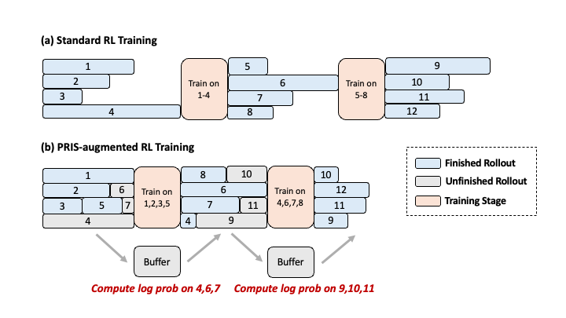
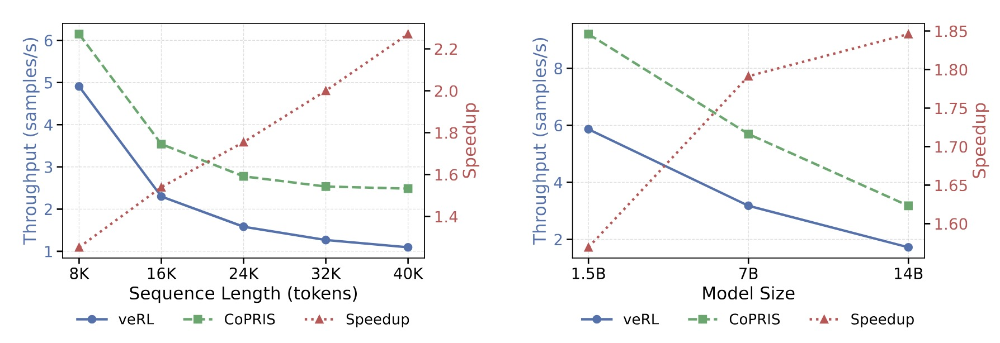

# CoPRIS


## Overview

CoPRIS (Concurrency-Controlled Partial Rollout with Importance Sampling) is a reinforcement learning (RL) training framework designed to enhance efficiency in large-scale RL post-training. It mitigates the long-tail problem from exceptionally long responses by early terminating rollout stages once sufficient trajectories are collected and reusing unfinished trajectories in subsequent rollouts, therefore eliminates idle computation during rollout. Additionally, CoPRIS incorporates cross-stage importance-sampling correction to ensure stable and unbiased optimization when mixing off-policy and on-policy trajectories. Together, these designs allow CoPRIS to achieve lossless throughput gains and scalable performance across model sizes and context lengths, paving the way for more efficient hybrid RL training systems.



This repository includes code, models, and datasets to reproduce the results presented in the associated paper.

## Repository Links

- **Code**: `./verl`
- **Base Model**: [DeepSeek-R1-Distill-Qwen-1.5B](https://huggingface.co/deepseek-ai/DeepSeek-R1-Distill-Qwen-1.5B) [DeepSeek-R1-Distill-Qwen-7B](https://huggingface.co/deepseek-ai/DeepSeek-R1-Distill-Qwen-7B)
[Qwen3-8B](https://huggingface.co/Qwen/Qwen3-8B)
- **Data Resource**: [DeepScaleR-Preview-Dataset](https://huggingface.co/datasets/agentica-org/DeepScaleR-Preview-Dataset)

## Setup and Configuration

### 1. Environment Setup

1. Follow the environment configuration steps provided in the [**verl official installation guide**](https://verl.readthedocs.io/en/latest/start/install.html).

### 2. Data Preparation

1. **Training data**: Download the training data from [DeepScaleR-Preview-Dataset](https://huggingface.co/datasets/agentica-org/DeepScaleR-Preview-Dataset) and preprocess it according to the [**verl data preparation guide**](https://verl.readthedocs.io/en/latest/preparation/prepare_data.html) to prepare data for post-training.

2. **Test Data**: Choose test datasets and process them using the same methods as the training data.

### 3. Model Training

1. Modify the parameters in ./CoPRIS_scripts/run_CoPRIS.sh according to your training and system configuration.

2. To train the **CoPRIS**, run the following command:

   ```bash
   bash ./CoPRIS_scripts/run_CoPRIS.sh
   ```

### 4. Model Evaluation

Our repository now supports differing response lengths between training and evaluation, as well as performing evaluations during the training process. You can configure the evaluation response length via the **max_model_len** in run_CoPRIS.sh, and adjust the evaluation frequency using the **test_freq**.

## Evaluation Results

If you successfully reproduce the above process and complete model training, you will obtain the following results:





